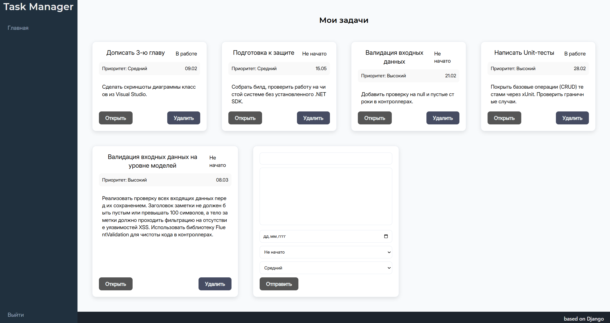

# Priority Tasker

Веб-приложение для управления задачами с приоритетами, построенное на Django.

## Описание

Priority Tasker — это система управления задачами, которая позволяет пользователям создавать, редактировать и удалять задачи с различными приоритетами и статусами. 



## Установка и запуск

1. Установите зависимости: `pip install -r requirements.txt`
2. Выполните миграции: `python priority_tasker/manage.py migrate`
3. Запустите сервер: `python priority_tasker/manage.py runserver`


### Админ-панель

Для доступа к админ-панели перейдите по адресу `/admin/` и войдите с учётными данными суперпользователя.

## Структура проекта

```
PTM/
├── priority_tasker/          # Основной проект Django
│   ├── manage.py
│   └── priority_tasker/      # Настройки проекта
│       ├── settings.py
│       ├── urls.py
│       └── ...
├── tasks/                     # Приложение задач
│   ├── models.py             # Модель Task
│   ├── views.py              # Представления
│   ├── forms.py              # Формы
│   ├── urls.py               # URL-маршруты
│   ├── admin.py             # Настройки админ-панели
│   ├── templates/           # HTML-шаблоны
│   └── static/              # CSS и JavaScript
└── requirements.txt         # Зависимости проекта
```

Проект создан в образовательных целях.

